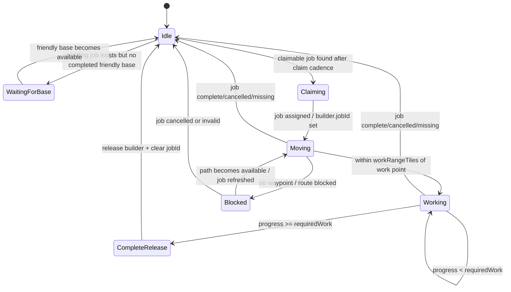
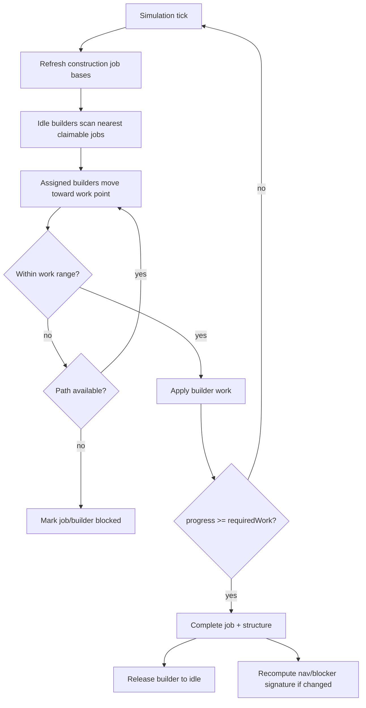

# Builder Autonomy State Machine

Builder crews are runtime workers. They should autonomously claim construction jobs and add progress over simulation ticks, without the player micro-clicking every hammer swing.

## Builder base/source rule for v0

Use this hierarchy:

1. Future dedicated builder yard/workshop structure, if/when it exists.
2. Otherwise, completed friendly outposts act as builder bases.
3. If there is no completed friendly base, the construction job remains pending/waiting.

Do not invent invisible builders. Do not teleport work into existence.

## State fields to inspect

| Field | Owner | Meaning |
|---|---|---|
| `builder.id` | GameState | Crew identity. |
| `builder.factionId` | GameState | Which jobs it may claim. |
| `builder.baseStructureId` | GameState | Completed friendly source/base. |
| `builder.jobId` | GameState | Claimed construction job or `null`. |
| `builder.state` | GameState | `idle`, `moving`, `working`, `returning` currently normalised. Blocked may appear in movement status. |
| `builder.position` / `builder.tile` | GameState | Authoritative runtime location. |
| `builder.movement` | GameState | Current movement status/target/terrain/speed summary. |
| `builder.movementPath` | GameState | Path cache/route detail for current move. |
| `builder.workPerTick` | GameState | Crew productivity multiplier. |
| `builder.lastClaimTick` | GameState | Prevents spam-claiming every tick. |
| `job.id` | GameState | Work item identity. |
| `job.structureId` | GameState | Structure being built. |
| `job.sourceBaseId` | GameState | Resolved builder source/base. |
| `job.assignedBuilderIds` | GameState | Crews currently assigned. |
| `job.maxAssignedBuilders` | GameState | Parallelism cap. |
| `job.progress` | GameState | Current work accumulated. |
| `job.requiredWork` | GameState / registry-derived | Completion threshold. |
| `job.state` | GameState | pending/claimed/active/blocked/complete/cancelled style work state. |

## Autonomous loop

## Design feel

Construction should feel grounded, not realistic-for-real-life slow. The v0 fantasy is:

- placed plans become visible foundations, stakes, dashed outlines, scaffold hints, and progress arcs
- builders visibly commit to the job
- multiple builders help, but with diminishing returns rather than silly exponential speed
- completed structures visibly switch from “planned” to “real world object”

That gives the “based” feeling without making Felix wait three weeks for a wall segment. We're not building Council Planning Simulator 2026, thank God.
