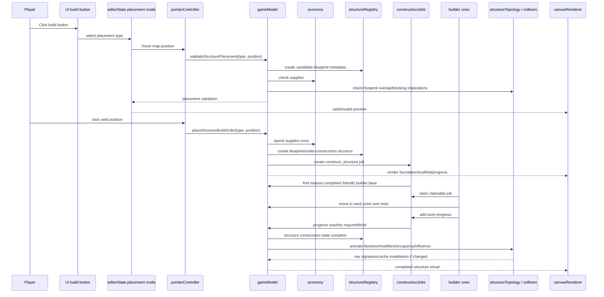

# Construction Flow

The target flow is button -> placement -> blueprint -> construction job -> builder work -> completed structure activation.

## Canonical state objects involved

| Object | Owner | Notes |
|---|---|---|
| `editorState.selectedPlacementType` / placement mode | `src/editor/editorState.js` | UI/editor state only. Does not spend supplies. |
| placement validation result | `src/game/gameModel.js` | Derived answer for preview. Not committed truth. |
| `economy.factions.player.stockpiles.supplies` | `src/game/economy.js` via `GameState` | Spend once on valid commit only. |
| `structure` entity | `src/game/structureRegistry.js` + `gameModel.js` | Runtime structure record with construction metadata. |
| `constructionJob` | `src/game/gameModel.js` | Runtime work queue item. |
| `builder` entity | `src/game/gameModel.js` | Runtime crew that can claim, move, work, idle. |
| `structureNavigation` signature/cache | `src/game/structureTopology.js` | Derived from completed structures only. |
| canvas preview/foundation/scaffold/progress | `src/rendering/canvasRenderer.js` | Visual projection only. |

## Source files likely involved

| Flow step | Main files |
|---|---|
| Build button list | `src/game/buildCatalog.js`, `src/ui/components.js`, `src/ui/gameUI.js` |
| Enter placement mode | `src/editor/editorState.js`, `src/input/pointerController.js` |
| Validate hover | `src/game/gameModel.js`, `src/world/fields.js`, `src/game/structureTopology.js` |
| Spend supplies | `src/game/economy.js`, `src/game/gameModel.js` |
| Create structure | `src/game/structureRegistry.js`, `src/game/gameModel.js` |
| Create/advance job | `src/game/gameModel.js` |
| Builder movement | `src/game/gameModel.js`, `src/game/collisionAuthority.js`, `src/game/structureTopology.js` |
| Structure activation | `src/game/structureTopology.js`, `src/game/collisionAuthority.js` |
| Visual preview/progress | `src/rendering/canvasRenderer.js` |
| HUD/status | `src/ui/components.js` |

## Failure states

| Reason | Expected meaning | Correct response |
|---|---|---|
| `unknown-structure` | Button or prompt references missing registry type | Fix registry/catalog mismatch, not renderer. |
| `out-of-bounds` | Position is outside map | Preview invalid; no spend. |
| `unbuildable-terrain` | Terrain passability/water disallows build | Preview invalid; no spend. |
| `insufficient-supplies` | Player cannot afford build | Preview invalid; no spend. |
| `overlaps-structure` | Footprint conflicts with existing non-ruined structure | Preview invalid; no spend. |
| `pending-builder-base` | Placement may be allowed but no completed friendly base exists | Job waits; do not fake instant build. |
| `blocked` job/movement | Builder cannot path/reach work point | Mark blocked/readable, do not teleport builder. |

## QA proof targets

| Step | Test expectation |
|---|---|
| Selecting a build type does not spend supplies | Browser smoke / future focused UI test |
| Hover validation distinguishes valid/invalid | Browser smoke screenshot + model validation |
| Committed placement spends once | `constructionJobs.test.mjs` |
| Blueprint/under-construction structure is created | `constructionJobs.test.mjs`, `structureRegistry.test.mjs` |
| Construction job is created | `constructionJobs.test.mjs` |
| Friendly completed outpost supplies builder base | `constructionJobs.test.mjs` |
| Builder claims job | `constructionJobs.test.mjs` |
| Builder moves and works over ticks | `constructionJobs.test.mjs` |
| Structure completes at `requiredWork` | `constructionJobs.test.mjs` |
| Completed blockers change nav signature | `constructionJobs.test.mjs`, `structureTopology.test.mjs` |
| Trench completes as modifier, not blocker | `constructionJobs.test.mjs`, `structureTopology.test.mjs` |

## The non-negotiable bit

Supplies are deducted on placement commit, not on hover, not on every tick, and not again when the builder starts work. Anything else is economy goblin nonsense.
