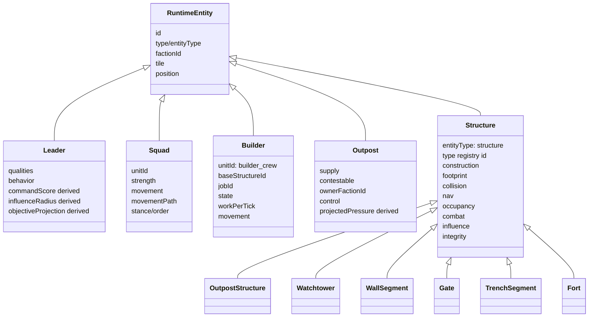

# Entity and Structure Hierarchy

Runtime entities live in `GameState`. Structures are now first-class runtime entities, but outposts still also exist as command/economy anchors.

## Structure matrix

| Type | Role | Supply cost | Required work | Max builders | Blocks movement? | Occupancy | Influence role | Current QA coverage |
|---|---|---:|---:|---:|---|---|---|---|
| `outpost` | control / builder base / income anchor | 80 | 100 | 2 | Yes | garrison, 2 squads | control 7.5, vision 8.5, defence 5 | `structureRegistry`, `structureTopology`, `constructionJobs`, `runtimePerformanceQa` |
| `watchtower` | vision / ranged platform | 45 | 70 | 2 | Yes | platform, 1 squad | vision 13, control 4, defence 4.5 | `structureRegistry`, `constructionJobs` |
| `wall_segment` | barrier / cover line | 30 | 55 | 2 | Yes | disabled wall-top placeholder | defence 2, threat modifier 0.35 | `structureRegistry`, `structureTopology`, `constructionJobs` |
| `gate` | passage-control | 45 | 90 | 2 | Yes when closed; friendly passage possible when open | disabled gatehouse placeholder | defence 3, control 1 | `structureRegistry`, `structureTopology` |
| `trench_segment` | cover / movement modifier | 25 | 45 | 1 | No hard blocker | trench, 1 squad | defence 2.8, cover 0.78 | `structureRegistry`, `structureTopology`, `constructionJobs` |
| `fort` | stronghold | 160 | 260 | 4 | Yes | garrison, 4 squads | control 11, defence 9, threat modifier 1.35 | `structureRegistry`, `constructionJobs` |

## Entity responsibility table

| Entity | Current role | Scales into | Do not do yet |
|---|---|---|---|
| Leader | Command-field emitter and player/enemy intent anchor | Hero/officer RPG layer, morale source, command traits | Make every unit a full expensive AI brain. |
| Squad | Foot movement/combat pressure unit | Formation, equipment, stance, XP | Recompute routes every frame. |
| Builder | Autonomous construction crew | Workforce, logistics, specialist labour | Turn construction into instant spawn again. |
| Outpost | Supply/command/builder base | Territory, recruitment, logistics hub | Mix outpost runtime control into map JSON. |
| Structure | Buildable topology/influence object | Upgradeable defences, occupiable buildings, tech modifiers | Let renderer decide blockers. |

## Future progression hooks

The structure definitions are already nicely expandable:

- `construction.requiredWork` can receive tech/workforce modifiers.
- `construction.materials` can become real resource-component costs.
- `integrity.maxHealth`, `armour`, and `breachState` can support siege/damage progression.
- `occupancy.capacitySquads` can scale with upgrades.
- `influence.controlRadius`, `visionRadius`, `defenceRadius`, and `threatModifier` can support research doctrines.
- `nav.movementCostModifier` can support roads, trenches, mud, gates, rubble.

Keep modifiers data-driven. Do not scatter “+10% tower magic” across renderer/UI code like a gremlin.
