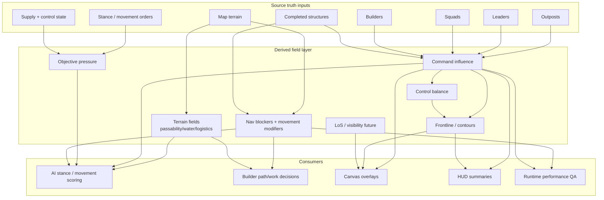

# Field Derivation Map

Fields are the nervous system of Field Fronts. They should explain battlefield pressure without becoming a performance bonfire.



## Current field families

| Field / projection | Inputs | Owner | Use | Persistence rule |
|---|---|---|---|---|
| Terrain passability/logistics | Map terrain | `src/world/fields.js` | Movement, placement, pathfinding | Rebuild from `MapData` |
| Command influence | Leaders/outposts/squads/structures + map | `gameModel`/`fields` | Control, overlays, AI pressure | Rebuild from `MapData + GameState` |
| Control balance | Command influence | derived runtime | Frontline/control visual | Do not persist as source truth |
| Frontline/contours | Command/control fields | derived runtime/render | Diagnostic visual | Do not persist as source truth |
| Structure navigation index | Completed structures + map | `structureTopology.js` | Movement blockers/modifiers | Cache only; rebuild from structures |
| Future LoS | Terrain + structures + units | future `world/game` seam | Fog/visibility | Derived; beware cost |

## Field cadence guidance

| Field | Safe cadence |
|---|---|
| terrain field lookup | Can be queried often if cheap/cached |
| full command-field recompute | Simulation tick or dirty-event, not render frame |
| frontline extraction | Simulation tick or overlay-visible dirty rebuild |
| contours | Diagnostic overlay visible only |
| LoS | Dirty + cadence + culling; never naive every-frame full-map |
| nav index | On structure signature change, not every unit movement |

## Performance warnings

- Fields are attractive because they make the game feel clever. They are also how you accidentally build a toaster oven.
- Prefer dirty flags, cache signatures, viewport culling, overlay visibility checks, and limited cadence.
- If field output can be rebuilt from map + game state, do not persist it as canonical truth.
- If a field becomes simulated over time, name and contract it explicitly before saving it.

## Semi-visual mental model

```txt
SOURCE TRUTH          DERIVED FIELD              VISUAL / AI USE
------------          -------------              ---------------
Map terrain       ->   passability/logistics  ->   movement + placement
Game entities     ->   command pressure       ->   AI + overlays
Structures done   ->   nav blockers/mods      ->   routing/collision
Orders/stance     ->   objective projection   ->   contest behaviour
All above         ->   frontline/contours     ->   tactical readability
```

## Future “truth layer” note

The older Living Fronts density prototype used a density/material/integrity substrate and cadenced field rebuilds. That is useful inspiration, but this project’s current source of truth is still the modular Field Fronts `MapData + GameState` architecture. Import concepts carefully; do not paste the old prototype wholesale into the new one like Frankenstein having a bad afternoon.
