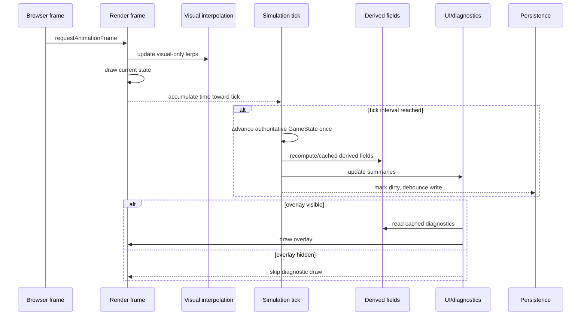

# Runtime Cadence Map

The player should see smooth motion while the simulation avoids doing expensive battlefield maths every render frame.



## Runtime lanes

| Lane | Cadence | Allowed | Forbidden | Tests/probes that should catch nonsense |
|---|---:|---|---|---|
| Render frame | Every `requestAnimationFrame` | Clear/draw canvas, hover preview, camera/view updates, visual-only interpolation | `advanceGameTick`, economy income, path rebuild, command field recompute, autosave write | `runtimePerformanceQa.test.mjs`, browser smoke, visual inspection |
| Visual interpolation | Every frame while active | Smooth leader/squad/builder render positions from last sim state to current sim state | Mutating authoritative entity position | `runtimePerformanceQa.test.mjs`, `gameModel.test.mjs` indirectly |
| Simulation tick | `state.simTickIntervalMs`, default 750 ms | Tick count, AI stance, movement step, construction progress, contest resolution, supply income, field recompute | Multiple catch-up ticks per frame unless explicitly building deterministic replay | `gameModel.test.mjs`, `constructionJobs.test.mjs`, runtime QA |
| Diagnostic tactical layer | Visible only, cached per sim state | Command wash, contours, radii, frontline, future LoS | Drawing/rebuilding while hidden, default visual clutter | browser smoke, runtime QA |
| Player event | Immediate | Build selection, placement commit, stance/order changes, terrain paint, manual step | Synchronous autosave every click, hidden expensive full rebuilds | editor/game tests + browser smoke |
| Persistence/autosave | Debounced, default around 60 s | Save dirty runtime/map state | Write every frame/tick | runtime QA, browser smoke |
| Map persistence | Explicit map edit/import/export | Authored terrain | Runtime entities/jobs/ticks | `editorModel.test.mjs`, `gameModel.test.mjs` |

## What must be computed every frame

Keep this tiny:

1. clamp current frame delta
2. accumulate tick time
3. update visual interpolation state
4. render current canvas state
5. process pending/debounced autosave checks without forcing a write

## What belongs on simulation ticks

- `game.tick += 1`
- leader/squad/builder movement
- enemy behaviour choice
- construction job claiming/progress/completion
- supply income
- contest/outpost control updates
- command field recompute
- frontline derivation
- dirty flagging

## Diagnostic overlay discipline

Default player view should not pay for field-debug toys. Tactical layers are useful, but they are diagnostic/unlockable until the game design says otherwise.

Recommended default:

```txt
active overlay: none
command radii: off
frontline: hidden unless requested
LoS/field grids: hidden unless requested
```

## Patch rejection checklist

Reject patches that:

- recompute command/LoS/frontline fields every animation frame
- mutate authoritative positions during interpolation
- autosave every frame or every tick
- draw diagnostic overlays by default
- run many catch-up ticks in one frame
- rebuild pathfinding/fields while the overlay is hidden
- add per-unit/per-tile work without profiling the horde/chokepoint probe
- hide runtime cost inside UI updates

## Simple agent test before touching runtime cadence

Ask:

```txt
Could this run every frame on a weak laptop with 500 squads and not make Felix swear?
```

If the honest answer is no, it needs a cadence, cache, dirty flag, or smaller scope.
