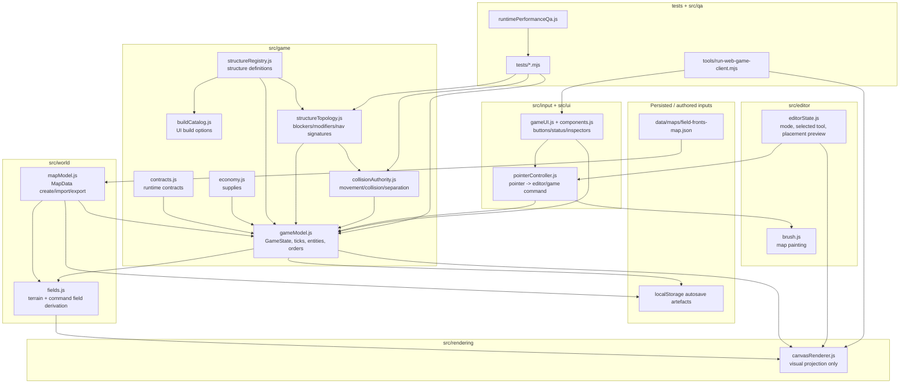

# System Topology

This is the module ownership map for the Field Fronts prototype.

## Ownership table

| Module | Owns | Must not own | Main consumers | QA coverage |
|---|---|---|---|---|
| `src/world/mapModel.js` | Authored `MapData`, map dimensions, terrain serialisation | Runtime entities, tick counters, construction jobs | `gameModel`, editor, renderer | `editorModel.test.mjs`, `gameModel.test.mjs` |
| `src/world/fields.js` | Derived terrain and battlefield field calculations | Persistent canonical state unless explicitly promoted | `gameModel`, `canvasRenderer` | `gameModel.test.mjs`, browser smoke |
| `src/editor/editorState.js` | Current editor/play mode, selected tool, placement state | Game economy, jobs, construction progress | pointer + UI + renderer | `editorModel.test.mjs`, browser smoke |
| `src/editor/brush.js` | Terrain edit stamping | Runtime command/order execution | editor state | `editorModel.test.mjs` |
| `src/game/contracts.js` | Runtime contract validation and entity shape boundaries | Rendering, DOM state | game model, tests | `gameModel.test.mjs`, `structureRegistry.test.mjs`, `constructionJobs.test.mjs` |
| `src/game/gameModel.js` | `GameState`, ticks, leaders, squads, builders, construction jobs, orders | Canvas details or DOM widgets | UI, renderer, tests | `gameModel.test.mjs`, `constructionJobs.test.mjs` |
| `src/game/economy.js` | Supply stockpiles and spending/income helpers | Map terrain truth | `gameModel`, UI | `gameModel.test.mjs`, `constructionJobs.test.mjs` |
| `src/game/buildCatalog.js` | UI-facing build options derived from registry | Structure truth itself | UI components | `structureRegistry.test.mjs` indirectly |
| `src/game/structureRegistry.js` | Structure type definitions and structure instance normalisation | Tick advancement or rendering details | `gameModel`, topology, tests | `structureRegistry.test.mjs` |
| `src/game/structureTopology.js` | Completed structure blockers, movement modifiers, nav signatures | Job assignment, economy, UI state | `gameModel`, collision, tests | `structureTopology.test.mjs` |
| `src/game/collisionAuthority.js` | Movement blockage and separation authority | Rendering or player input | `gameModel` | `collisionAuthority.test.mjs` |
| `src/input/pointerController.js` | Pointer interpretation and command dispatch | Persistent truth by itself | editor/game/UI | browser smoke + model tests where relevant |
| `src/rendering/canvasRenderer.js` | Visual projection of current state | Gameplay truth, economy, construction mutation | browser/user | browser smoke, `node --check` |
| `src/ui/components.js` / `gameUI.js` | DOM controls, panels, status, build buttons | Game model ownership | player/browser smoke | browser smoke |
| `src/qa/runtimePerformanceQa.js` | Runtime performance probes and report generation | Gameplay authority | tests/output artefacts | `runtimePerformanceQa.test.mjs` |
| `tests/*.mjs` | Behaviour and contract protection | Runtime feature ownership | humans + agents | `npm.cmd test` |

## Agent rule of thumb

If you cannot say which module owns the thing you are editing, stop. You are about to scatter truth like a muppet with a leaf blower.
