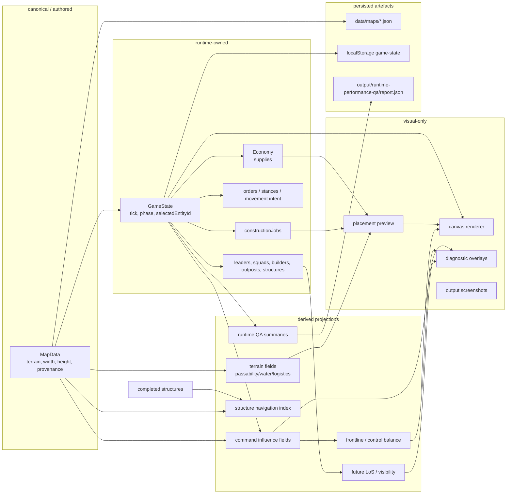

# Truth Ownership Map

This map exists to stop agents from confusing authored map data, runtime state, derived projections, UI summaries, and QA evidence.

## Classification legend

| Classification | Meaning | Examples |
|---|---|---|
| `canonical/authored` | Designed level input. Safe to round-trip through map tools. | `MapData`, `data/maps/field-fronts-map.json` |
| `runtime-owned` | Mutable gameplay truth. | `GameState`, `economy`, `structures`, `builders`, `constructionJobs` |
| `derived/projection` | Rebuilt from source truth. Useful, not canonical by default. | command fields, frontline, nav index, terrain fields |
| `visual-only` | What the user sees. Must not mutate gameplay truth. | canvas rendering, placement preview, overlays |
| `diagnostic-only` | Developer/agent readouts. Helpful, not game authority. | tactical overlays, runtime QA summary panels |
| `evidence artefact` | Proof that something happened. Not automatically live truth. | screenshots, browser states, `output/runtime-performance-qa/report.json` |

## Do not confuse these

| Thing | Is | Is not |
|---|---|---|
| `MapData` | Authored terrain/map truth | Runtime game state |
| `GameState` | Runtime truth | Map-maker export |
| `constructionJobs` | Runtime-owned work queue | Renderer effect |
| `placementPreview` | Visual/UI validation surface | A committed build order |
| `command fields` | Derived projection from map + entities | Persisted canonical truth |
| `frontline` | Derived visual/diagnostic relationship | A permanent border unless design explicitly changes |
| `structureNavigation` cache | Derived runtime acceleration | Source of structure truth |
| QA report | Evidence about runtime health | Authority to change game state |
| Browser screenshot | Visual proof | Behaviour proof by itself |

## Ownership warnings

- A structure is not a blocker until its construction state and topology say it is relevant.
- A trench is complete but should become a movement modifier, not a hard blocker.
- A build button click is not the same thing as a placed construction job.
- A valid preview must not spend supplies until the player commits placement.
- A derived field can be cached, but that cache must be rebuildable from map + game state.
