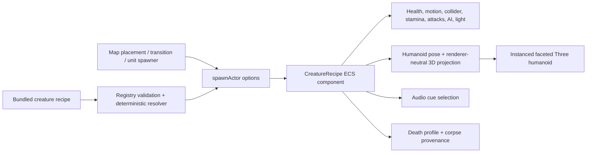

# Procedural Raider Recipe-to-Gameplay Pipeline

Status: implemented and browser-proven on 2026-08-03.

## Canonical ownership

`src/data/creatures/raiderCreatureRecipe.js` owns the raider's gameplay and visual recipe under `black-sky-bound.creature-recipe.v1`. `src/data/creatures/creatureRecipes.js` validates registry references and resolves a deterministic `black-sky-bound.creature-recipe-instance.v1` for ECS.

`ACTORS.raider` is now only the compatibility entry point: actor identity, faction, role, and `defaultCreatureRecipeId`. Non-migrated actor kinds retain their current actor-definition path.

The resolved ECS component owns:

- recipe id, unsigned seed, provenance, and stable variant signature;
- immutable gameplay references and balance values;
- bounded body proportions, material palette, equipment selections, and idle phase;
- audio cue ids and death profile id.

V1 deliberately excludes loot, personality axes, behavior trees, generalized attack organs, and agent proposal state because no current runtime consumer owns those fields.

## End-to-end landings



Optional authoring input is:

```json
{
  "creature": {
    "recipeId": "raider_scavenger_family_v1",
    "seed": 17
  }
}
```

Legacy placements remain valid when the `creature` block is absent. An explicit invalid recipe, seed, actor-kind binding, material, attachment, socket, attack, audio, or death reference fails loudly.

Seed precedence is:

1. explicit unsigned seed;
2. stable hash of authored placement id;
3. stable hash of spawner id plus spawn ordinal;
4. stable direct-spawn source.

The same authored map and spawn order reproduce the same recipe variants.

## Visual embodiment

`ThreeProceduralHumanoidLayer` consumes the existing authoritative humanoid points and sockets. The recipe describes body masses, limb segments, clothing/equipment roles, attachments, materials, and bounded variation; the renderer supplies only reusable faceted geometry, instancing, transforms, and disposal.

Recipe-backed raiders no longer enter the legacy uniform-cylinder and white-joint renderer. The production result includes a solid torso and hips, faceted head, hands and feet, cloth/leather layers, belt, mask/cowl, asymmetric shoulder armour, optional pack or bedroll, spear, torch, material separation, a restrained night-readability floor, and real bounded shadows. Torch shadow near-clipping prevents the carried light from projecting its owner's body as a screen-filling silhouette while preserving shadows beyond the carrier.

Repeated primitive/material families are instanced. Pose changes update matrices only; topology is stable after pool warm-up. F3 exposes recipe, seed provenance, signature, attachments, primitive counts, draw families, allocations, topology changes, and missing sockets.

## Evidence and gates

The durable visual report is `artifacts/webgl3d-raider-visual-v1/report.json`; the inspected contact sheet is `artifacts/webgl3d-raider-visual-v1/contact-sheet.png`. The lane covers a twelve-seed family, close idle/walk/attack/guard/impact poses, smoke and lightning, live combat, death aftermath, 100 raiders, and F3 diagnostics.

Run the focused gate with:

```text
npm run smoke:raider-visual
```

Contract/pipeline coverage lives in `tests/creatureRecipePipeline.test.mjs`; instancing/topology/disposal coverage lives in `tests/threeProceduralHumanoid.test.mjs`. Both are included in `npm test`.

## Deferred AXIOM slices

No AXIOM authoring or agent-control path is changed by this slice. The next recipe work should migrate husks, werewolves, and the wyvern only after their real consumers are identified. Later schema versions can add wired loot, personality, attack-organ, and procedural-emitter systems. AXIOM can then expose the canonical recipe library, deterministic previews, validated proposals, and explicit apply controls without inventing a second recipe authority.
