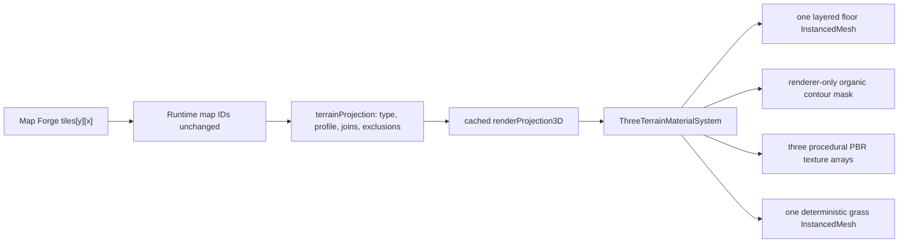

# Black Sky Bound three-material terrain foundation

Completed and reference-gated on 2026-07-31.

## Outcome

Black Sky Bound now renders `grass`, `dirt`, and `scorched` terrain identities as one layered physical floor material plus one culled grass-detail instance batch. The authored Map Forge grid remains the gameplay authority. A renderer-only organic contour field deforms the visual silhouette between identities without changing tile IDs, collision, movement, blocking, or saved map data.

This is a three-material foundation, not a biome system. Forest, rock, and water retain their existing scalar material path.

## Previous rendering path

Map Forge authored stable string IDs in `tiles[y][x]` and copied them unchanged into `black-sky-bound.runtime-map.v0`. The runtime loader validated them, `src/world/terrain.js` supplied gameplay definitions and scalar material profile IDs, and `src/projection/terrainProjection.js` emitted renderer-neutral per-tile packets.

The active Three.js floor then grouped packets by type and submitted one `InstancedMesh` of `BoxGeometry` per terrain type. Each used a constant-colour `MeshStandardMaterial` with scalar roughness. Box UVs restarted on every tile, but no texture was bound. There were no active normal, AO, height, array-texture, splat-mask, or grass-detail paths. A retired WebGL renderer contained whole-map colour and connected-dirt experiments, but it was unreachable and was not revived.

The full pre-change audit is in `docs/TERRAIN_MATERIAL_RENDERING_BASELINE.md`.

## Preserved and reused

- Stable Map Forge terrain IDs and unchanged runtime-map serialization.
- `TerrainType`, movement cost, collision, blocking, and obscuring ownership.
- Terrain-to-material-profile validation.
- Static `renderProjection3D` cache and renderer-neutral terrain packets.
- Existing instancing/no-per-tile-draw-call policy.
- Connected-rule and terrain-spline metadata for grass and dirt.
- Physical lights, fog, shadows, tone mapping, GPU timer queries, and F3 diagnostics.
- Authored scene-object bounds as detail exclusion/bias inputs only.

## Implemented rendering path

The three target types share one plane-geometry `InstancedMesh` and one customized `MeshStandardMaterial`. World X/Z coordinates drive continuous UVs, so texture phase does not restart at tile borders. Three equal-sized `DataArrayTexture` objects hold base colour, OpenGL normal, and packed roughness/AO/detail-height layers. Array layers eliminate atlas gutters and cross-material mip bleeding; repeat wrapping, generated mipmaps, trilinear filtering, and anisotropy provide stable distance sampling.

The shader uses two differently rotated/scaled micro samples plus world-space macro colour and roughness variation. Height is conservative normal-detail input only; there is no displacement.

### Organic visual boundary field

The 640x480 mask (8 samples per authored tile on the 80x60 proof map) does not blur a square ownership edge. It constructs different implicit shapes:

- rounded cores retain identity at each authored tile centre;
- cardinal and diagonal capsules turn sequences of dirt IDs into continuous paths;
- region capsules merge grass and scorch cells into curved masses;
- deterministic off-centre lobes create small incursions and opposing erosion pockets;
- independent broad and medium domain warps bend long contours;
- feature radii and feather widths vary spatially to avoid uniform shoulders.

Final diagnostics record 6,546 pixels whose dominant rendered material crosses the authored tile ownership boundary and zero target tile-centre identity mismatches. The mask is recreated only on a static terrain rebuild and is never serialized back to Map Forge.

### Grass detail

One reusable 30-triangle clump contains ten tapered, bent blades. All visible clumps are instances in one draw call. Placement is deterministic from map identity/revision, tile coordinates, and candidate index. Low-frequency patch noise prevents uniform coverage; a shared slowly varying prevailing angle avoids radial starbursts.

Candidates are rejected or suppressed around dirt/scorch, occupied objects, spawn, and escape areas. Density increases around appropriate natural boundaries after an inner clearance. The instance list is distance-culled and rewritten only when the camera changes culling cell.

## Source and licence

No downloaded, scraped, AI-generated, or third-party texture is shipped. All PBR texels and grass geometry are deterministic project-authored source:

- definitions: `src/data/terrainMaterialLayers.js`;
- textures: `src/render/backends/three/ThreeTerrainPbrTextures.js`;
- contour mask: `src/render/backends/three/ThreeTerrainBlendMask.js`;
- grass geometry/scatter: `src/render/backends/three/ThreeGrassDetail.js`.

Runtime source is `deterministic_periodic_procedural_original`; licence is the project source's own terms, with no external attribution. Seam periodicity, OpenGL normal orientation, roughness/AO ranges, texel density, and mip/wrap policy are automated in `tests/terrainMaterialSystem.test.mjs`. Full detail is in `docs/TERRAIN_MATERIAL_ASSET_PROVENANCE.md`.

## Online visual reference gate

The first terrain screenshots were rejected as below the visual bar. A second pass compared official screenshots from [No Rest for the Wicked](https://store.steampowered.com/app/1371980/No_Rest_for_the_Wicked/), [V Rising](https://steamdb.info/app/1604030/screenshots/), [Last Epoch](https://store.steampowered.com/app/899770/Last_Epoch/?l=english), and [Diablo IV](https://steamdb.info/app/2344520/screenshots/).

The shared lessons were quiet continuous ground, clean paths, irregular material masses, clustered foliage near natural boundaries, coherent blade lean, restrained saturation, and lighting-led drama. Those references caused concrete changes to contour shape, clump topology/orientation/density, albedo, validation lighting, and camera target selection. No reference image was copied, traced, or packaged. The exact reference-image links and comparison notes are in `docs/TERRAIN_VISUAL_REFERENCE_TARGETS.md`.

## Diagnostics and controls

- F3: normal renderer diagnostics plus grass instance count and culling bounds.
- F6: cycles lit, material-ID, and normal-only terrain views.
- F7: toggles all ground-detail geometry.
- URL tuning: `groundDetail=0|1`, `grassDensity=<0..1.5>`, `grassCullMeters=<2..18>`, and `terrainView=lit|material-id|normal-only`.
- Source defaults: density `0.36`, two candidates per grass tile, 7.5 m cull distance, 30 triangles per visible clump.
- Missing or mismatched material data logs a diagnostic error and renders explicit magenta wireframe; it never silently falls back to flat colour.

## Visual evidence

The final Playwright lane uses the real production Three.js backend at 1440x900 DPR 1, fixed render time, deterministic lights, and zero actors/transient weather. Material-isolation images hide tree canopies and screen UI; the normal gameplay-height capture restores canopies. It covers close grass, gameplay height, grass/dirt, scorch/grass, light-left/right, low-light readability, broad repeated grass, material IDs, normal-only, and instance bounds/count.

It also recaptures the original baseline coordinates and light values. Those locations remain heavily canopy-occluded, which is why separate canopy-clear material-proof targets are used for visual judgment.

Evidence root: `artifacts/terrain-material-v1/final-reference-gated/`.

## Performance evidence

### Clear material-proof camera

| Ground detail | Calls | Triangles | Visible clumps | Render p95 | Frame p95 | GPU p95 |
|---|---:|---:|---:|---:|---:|---:|
| Off | 123 | 130,432 | 0 | 4.1 ms | 10.2 ms | 8.768 ms |
| On | 124 | 139,522 | 303 / 1,397 candidates | 3.9 ms | 10.3 ms | 8.886 ms |

Grass therefore adds exactly one draw call and 9,090 triangles at this camera. The measured GPU p95 delta is +0.118 ms; render-path variance makes the CPU p95 delta non-actionable at -0.2 ms.

### Original locked baseline camera and lighting

| State | Calls | Triangles | Render p95 | Frame p95 | GPU p95 |
|---|---:|---:|---:|---:|---:|
| Pre-change flat terrain | 155 | 130,168 | 2.4 ms | not recorded | 8.816 ms |
| New materials, detail off | 153 | 97,138 | 3.9 ms | 7.4 ms | 6.199 ms |
| New materials, detail on | 154 | 101,908 | 4.0 ms | 7.5 ms | 6.094 ms |

At this fixed position 159 clumps add one call and 4,770 triangles. The baseline did not record frame intervals, and short GPU-query samples vary; these numbers should be read as evidence for budget and deltas, not a universal speed-up claim.

### Full renderer stress gate

| Profile | Calls | Triangles | Frame p95 | Render path p95 | GPU p95 |
|---|---:|---:|---:|---:|---:|
| Locked DPR 1 | 238 | 81,476 | 16.7 ms | 8.1 ms | 7.615 ms |
| Native DPR 1.5 | 238 | 81,476 | 16.8 ms | 9.0 ms | 14.213 ms |

Both profiles pass without lowering DPR, light capacity, shadow slots, smoke, particles, or scene density. The packaged-browser proof reports 123 calls, 31,510 triangles, successful movement, raw-source HTTP 404, and zero console/page/request/HTTP errors.

## Validation completed

- `npm test` — pass.
- `npm run test:loc` — pass.
- `tests/terrainMaterialSystem.test.mjs` — pass, including seamlessness, normal orientation, fail-visible data, contour displacement, and tile-centre identity.
- `tests/playtest/terrainMaterials.playtest.mjs final-reference-gated` — pass with zero console, page, or request failures.
- `tests/playtest/webgl3dPerformance.playtest.mjs` — both profiles pass.
- `npm run build:playtest` — pass; 15-file curated package, no raw source or source maps.
- `tests/playtest/webgl3dBuiltPackage.playtest.mjs` — pass.

## Known limitations

- Only grass, dirt, and scorched terrain use the layered system; forest, rock, and water remain on the existing instanced scalar-material path.
- The contour mask is static per map revision. Dynamic terrain painting would require an explicit rebuild/update path.
- Detail height affects normals only; parallax and displacement are intentionally absent.
- Grass has deterministic static lean, not animated wind or interaction bending.
- The proof uses procedural source rather than hand-authored hero textures; future material additions must meet the same seamlessness, texel-density, diagnostic, and reference gates.
- The broad neutral-light repetition rig is validation-only. Production lighting was not brightened to make screenshots pass.
- Old baseline coordinates are poor art-review locations because mature canopy silhouettes obscure most ground; they are retained for performance/comparison evidence, while canopy-clear targets are the visual acceptance source.
